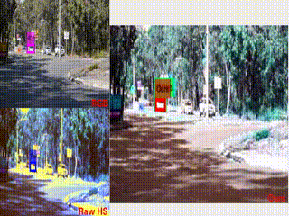

# Semantic-embedded Unsupervised Spectral Reconstruction from Single RGB Images in the Wild
Source code of the ICCV2021 paper: "Semantic-embedded Unsupervised Spectral Reconstruction from Single RGB Images in the Wild"

Tracking demo:

 

Pretrianed model: https://drive.google.com/drive/folders/1A4wUnwWXVe6w0ktYciPN5FDUeFDy7xko?usp=sharing
code for preparing HS dataset: https://drive.google.com/drive/folders/1yOKAAhNQ6nymfqbS8DP6e3OxljHjxPW9?usp=sharing
